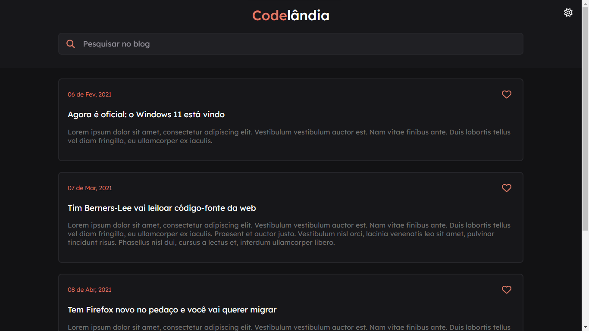

# Blog Codelândia




> O Blog Codelândia foi desenvolvido a partir do design feito no Figma  pela comunidade Codelândia no [Discord](https://discord.gg/uHWE7QbXnp). Atualmente você pode alterar o tema do site, buscar por um comentário e curtir um comentário.

## 🥳 Visualizar o projeto

Caso não queira instalar e usar o Blog Codelândia localmente, ele também está hospedado. Sendo possível, através desse [link](https://meu-blog-codelandia.netlify.app/), você ser redirecionado para ele.

## 💻 Pré-requisitos

Antes de começar, verifique se você atendeu aos seguintes requisitos:
 
- Você deve ter instalado na sua máquina [Node.js](https://nodejs.org/en) e [Angular CLI](https://angular.io/guide/setup-local)

## 🚀 Instalando Blog Codelândia

Para instalar o Blog Codelândia, siga estas etapas:

Clone o repositório:

```
git clone https://github.com/MatheusKerscher/blog-codelandia.git
```

Acesse a pasta do repositório:

```
cd blog-codelandia/
```

Instale as dependências do projeto:
``` 
npm i
```

## ☕ Usando Blog Codelândia

Para usar Blog Codelândia, siga estas etapas:

Executar e abrir o projeto:
```
ng s -o
```

> A flag "-o" fará o projeto já ser aberto em uma nova guia no navegador padrão do seu compuador.
